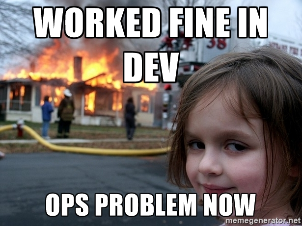

# Microservices & Cloud Native

---

## Overview

 - Intro to
  - Cloud Native
  - Devops
  - Microservices
  - Containers

 - Docker 101

---

## Cloud Native

 - Designing apps for the Cloud *First*
 - Designing for scalability
   - Ability to handle large numbers of users
 - And reliability
   - 5 nines etc
   - Assume failure

---

 - Using modern techniques
   - Microservices
   - Programmable infrastructure
 - And modern technology
   - containers
   - dynamic orchestration platforms

---

## DevOps

 - Traditionally
  - Developers created applications
  - Operations hosted and maintained them

---

## Lead to a "wall"

 - Developers "threw" software over the wall
  - Little regard for complete testing or reliability
 - Ops responsible for keeping things running
  - On call
  - Pushed back heavily on software/libraries

---

## Issues

 - Slow updates
 - Poor relations between dev and ops
 - Issues with upgrades/releases

---

## Devops

 - Acknowledges both dev and ops
   - are part of the same team
   - attempts to tear down the wall
 - *Teams* become responsible for running services
  - made up of both dev and ops
  - on-call

---

## Microservices

 - System architecture that uses multiple small services
 - Each one has a simple, well-defined job
 - As opposed to "monolithic" architectures

---

## Monoliths

 - Entire system in one program
 - Typically Java/C#
  - still prevalent in enterprise
  - Scale *up*, not out

---

## Microservices

 - Lightweight SOA
 - Composable
  - Talk over APIs
  - REST and HTTP, GRPC
 - May use multiple languages
 - Scale *out*

---

### Relationship to SOA

- Similar to SOA.

Microservices can be thought of as a specific implementation of SOA. (Like scrum/XP is an
implementation of agile)

SOA often got stuck because people said SOA but were really still monoliths. No help how/where/why
to split services.

---

## Microservice Design

The key elements of design (just like software!):

- Loose coupling

I.e. when one microservice changes, you don't have to change another.

Beware of knock on-changes.

Design for "if I were to change this, how would it affect the rest of the system"

- High Cohesion

Related concepts should live together.

If we do have to make changes, they should occur in one place only.

---

### How? Domain Driven Design

Eric Evans DDD fits really well with Microservices.

Model the domain. Simulate the domain in software.

Separate microservices in _Bounded Contexts_. Really important concept:

- A bounded content is a boundary separating internal (hidden) and external (shared) models.

Internally, the software models the domain in detail.

But at the interface, the boundary, there is only a small API. Like a cell.

---

#### Other DDD concepts

- Types of object
    - Entities
    - Value
- Types of operator
  - Repositoy
  - Service
  - Factory
- Collections of objects
  - Aggregate

DDD is a definite recommendation for all software engineers.

---

### Orchestrated vs Choreographed

Imagine a service that places orders. Once the order is placed we need to:

- Send an email confirmation
- Send the order for processing
- Charge a credit card

If the service initiates these things, we say it is orchestrated.

If we emit an event to say that something has been ordered, others can subscribe to that event and
process the event when they want to. This is called choreographed.

Choreographed services are more decoupled.

To the extreme: event sourcing.

---

### RPC vs. REST

- REpresentational State Transfer
  - Inspired by the web
  - Based upon resources (decoupled from actual implementation)
  - Very related to entities in DDD
  - Usually used with HTTP (GET, PUT, POST, DELETE, PATCH)
  - Generally quite slow
  - Human readable, simple.
- RPC
  - Originally used to _remotely call_ procedures. I.e. tell the remote how to do it's job. (Would
    you do this when asking for a coffee?)
  - Leads to coupling and brittleness
  - BUT, that's an implementation problem.
  - Avoid coupling and RPC is much faster. Can schema controlled. E.g. see GRPC with protobufs.

Also see: Reactive extensions, asynchronous vs. synchronous

---

### A note on DRY

Don't Repeat Yourself.

- Stick to DRY within a microservice.

- Fine to violate DRY across services.

Remember the goal is decoupling. Shared Modules/libraries are a form of coupling.

---

### Immutability and code design

- Side-effect free code

- Return the same type of object as requested in the parameters (where possible)

- Simplify API's and interfaces

- Test first, imagine you're a user of the API

- Minimalism!

---

### Prefer Flexibility, but accept Versioning

- Design to accept as much as possible (tolerant reader)

- Return as little as possible

- Changing API's is not ideal, but happens. Depends on how public you're API is.

See: Martin Fowler - Tolerant Reader; Robustness principal.

---

### Easier to break apart than merge together

Beware of premature decomposition. Never start by splitting the domain, you will get it wrong and it
is hard to fix.

Start working towards a Monolith and break apart when you see clean domain contexts.

Remember that the businesses is probably organised to match the domain. Team changes may be
required.

---

### Splitting for technical reasons is usually wrong

E.g. splitting database and back end. If you change the DB you need to change the service.

Same with front-end -> backend coupling, but front-end code is harder to keep within your domain for
technical reasons.

Can be the right idea in some cases. E.g. performance objectives or regulatory data requirements.

---

### Avoid Shared Data(bases)

Avoid this like the plague. Shared databases are a source of performance bottlenecks, complication
and the reason why we need DBAs.

If each microservice has it's own DB with it's own requirements, then it can use the DB in any way
it sees fit.

Remember, low coupling. The DB should be completely hidden from end users. They shouldn't care if
you change it internally from a DB to a file store.

---

### Treat your API users like customers

Make it as easy as possible for people to use your API.

Treat them as valued customers.

- Simple APIs

- If you have to make breaking changes, run your old API alongside the new one.

- Run multiple concurrent versions of the same service if necessary.

---

### Front-ends in Your Microservice?

This is contentious.

This suggests, if you present your domain/service in a UI, consider moving the UI component into
your bounded context. I.e. into your microservice.

Then if you need to make changes/improvements to your domain, you can simply update the front-end
code too.

Contentious because it merges the front-end and back-end roles. Disciplines that have different
technical requirements. (Graphic design anyone?)

Also, actually generating and delivering the front-end code can be clunky.

---

Generally prefer "back-ends for front-ends" services that are created to service one type of front
end. E.g. a mobile front-end might get a different (simplified?) backend interface.

---

## Minimalism

How big should a Microservice be?

 - James Lewis Head Metric

 - *Services must be small enough to fit in James Lewis's head*

 - http://www.bovon.org/archives/350

---

### Microservice Size

Related to the size of the domain.

Related to the concept being modelled from the domain.

Remember: Minimalism vs. cohesion vs. coupling

---

### Lean - Minimal Viable Product

An MVP is a product that does just enough, but not more.

Every addition adds value.

If it doesn't add value, don't add it.

Search for minimalism in everything you do:
- APIs
- Code
- Features
- Data

---

## Conway's Law

*organizations which design systems ... are constrained to produce designs which are copies of the
communication structures of these organizations*

Melvin Conway

---

## Team Size - Two Pizza Teams

 - Small team sizes
 - Decentralized
 - Less communication overhead

---

### Team Composition

- Multi-functional

- Related to the domain

- Usually:
  - Developers
    - Front-end
    - Back-end
  - Business analyst
  - Data scientist?
  - Domain experts?

---

## Containers

 - Portable format for developing and deploying applications
 - Almost synonymous with microservices
 - Also great fit for Devops

---

## Testing Microservices

Microservices introduce several levels of testing.

At the very least:

- Unit
- Microservice level

---

### Testing Pyramid

Ideally, a pyramid of tests. From top to bottom:

- User tests: when a user follows a "happy path" (e.g. view catalogue, add to cart, checkout cart).
- End-to-end tests: using containers and all dependencies. E.g. database.
- Container tests: using mocked dependencies.
- Component tests: (sometimes merged with above) - contract testing, internal wiring tests, main application.
- Unit tests: low level individual methods/classes

---

### How many tests

- User tests: very few
- End-to-end tests: some
- Container tests: many
- Component tests: many
- Unit tests: lots, near full coverage.

---

### Testing Tips

- Test actual behavior, not just for coverage

- Aim to write non-brittle tests. Tests shouldn't fail when you change implementation.

- Imagine you're a user of the service.

---

## CI/CD

Have specific training material on CI/CD.

But each microservice should have it's own Git repository. It's own pipeline. And should be
independently deployable (not always possible).

Remember each microservice is the responsibility of a team.

So each team should be empowered with their own set of tools.

- Generally recommend standardising tools to prevent fragmentation. E.g. pick a CI/CD tool.

---

### Service Configuration

- Simplest and easiest to keep configuration in Git if possible (e.g. k8s ConfigMaps)

May be domain specific requirements for configuration.

### Application Configuration

For the entire application configuration, i.e. the whole production system, it is recommended that
this also resides in it's own Git repository.

That way, in case of absolute disaster, it should just be a case of re-provisioning the
infrastructure and re-applying your application configuration.

---

## New Issues

All of this brings lots of new issues, and new things to think about:

- Service discovery
  - DNS
  - Consul
  - Zookeeper
  - Eureka
- Autoscaling
  - Machine level, service level (see kubernetes)
- Monitoring
- Logging
- Procedural concerns: updates, error handling, on-call

Etc. Etc.

---

## Conclusion

- Devops, Microservices and Cloud Native help us deal with requirements for:
  - Efficiency
  - Resiliency
  - Innovation
- Culture of automation
- Hide the details
- Independently deployable (as far as possible)
- Isolate and expect failure
- Start monolithic, break out later
- Domain driven design

